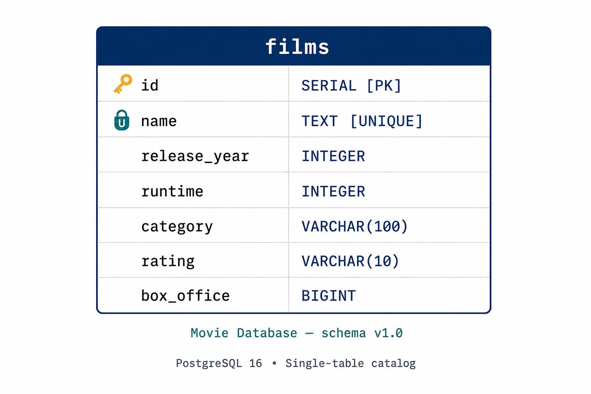
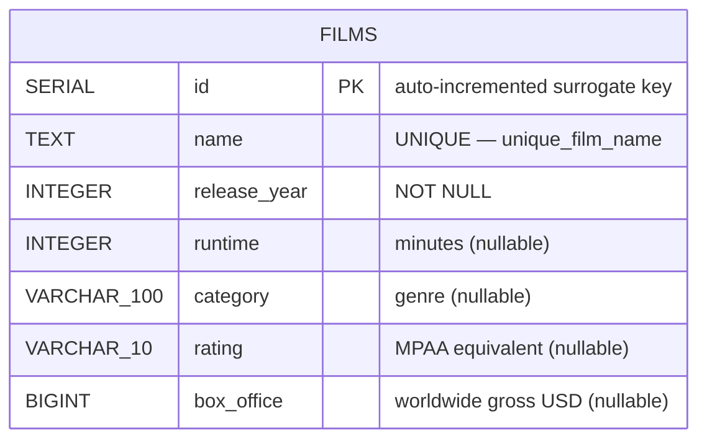

# Movie Database — PostgreSQL Blueprint

A small, recruiter-friendly PostgreSQL project that demonstrates mastery of the
fundamentals every backend engineer is expected to ship: clean DDL, idempotent
migrations, transactional DML, retroactive constraints, indexed reads, and a
one-command local environment via Docker Compose.

The database models a film catalog with a single `films` table. Every artifact
in this repository is text-based and reproducible — there are no binary database
files, no committed credentials, and no machine-specific paths.



---

## Table of Contents

1. [Features](#features)
2. [Tech Stack](#tech-stack)
3. [Repository Layout](#repository-layout)
4. [Entity-Relationship Diagram](#entity-relationship-diagram)
5. [Schema Reference](#schema-reference)
6. [Quick Start (Docker)](#quick-start-docker)
7. [Manual Setup (Local Postgres)](#manual-setup-local-postgres)
8. [Running the Migrations](#running-the-migrations)
9. [Sample Queries](#sample-queries)
10. [Testing the UNIQUE Constraint](#testing-the-unique-constraint)
11. [What Is and Isn't Committed](#what-is-and-isnt-committed)
12. [License](#license)

---

## Features

- **Idempotent DDL.** `CREATE TABLE IF NOT EXISTS`, `DROP TABLE IF EXISTS`, and
  `ADD COLUMN IF NOT EXISTS` guards let every script be replayed safely.
- **Transactional DML.** Every mutating script is wrapped in `BEGIN … COMMIT`
  so partial failures roll back atomically.
- **Versioned migrations.** Each schema change ships as its own numbered file
  in [`migrations/`](migrations/), so the database history is auditable.
- **Retroactive integrity.** A `UNIQUE` constraint is added by name
  (`unique_film_name`) after seed data is in place — mirroring real production
  workflows where invariants tighten over time.
- **One-command bring-up.** A `docker-compose.yml` mounts the SQL files into
  the official Postgres image's init hook, so `docker compose up -d` is the
  only command a reviewer needs.
- **Self-documenting schema.** `COMMENT ON TABLE` / `COMMENT ON COLUMN` make
  the schema legible from `psql \d+ films` and from any GUI client.

## Tech Stack

| Layer        | Choice                                        |
| ------------ | --------------------------------------------- |
| Database     | PostgreSQL 12+ (CI tested on 16-alpine)       |
| Local infra  | Docker Compose v2                             |
| Tooling      | `psql`, optional GUI (Postbird / DBeaver / pgAdmin) |
| Language     | Pure SQL — no ORM, no application layer       |

## Repository Layout

```
.
├── .env.example                 # Template for required env vars (blank values)
├── .gitignore                   # Excludes secrets, data dirs, dumps, logs
├── docker-compose.yml           # One-command Postgres bring-up
├── PRD.md                       # Product Requirements Document
├── README.md                    # You are here
├── schema.sql                   # Consolidated DDL (final state)
├── seed.sql                     # Sample non-sensitive seed data
├── docs/
│   └── er-diagram.png           # Visual schema diagram
├── migrations/
│   ├── 001_create_films_table.sql
│   ├── 002_seed_initial_films.sql
│   ├── 003_add_metadata_columns.sql
│   ├── 004_backfill_metadata.sql
│   ├── 005_add_unique_film_name_constraint.sql
│   └── 006_add_indexes.sql
└── queries/
    ├── filter_by_release_year.sql
    ├── aggregate_box_office_by_category.sql
    └── test_unique_constraint.sql
```

## Entity-Relationship Diagram

The full visual is in [`docs/er-diagram.png`](docs/er-diagram.png). The same
schema rendered as a GitHub-native Mermaid diagram:



## Schema Reference

| Column         | Type           | Constraints              | Purpose                                  |
| -------------- | -------------- | ------------------------ | ---------------------------------------- |
| `id`           | `SERIAL`       | `PRIMARY KEY`, `NOT NULL` | Auto-incremented surrogate key           |
| `name`         | `TEXT`         | `UNIQUE`, `NOT NULL`     | Film title                               |
| `release_year` | `INTEGER`      | `NOT NULL`               | Year of public release                   |
| `runtime`      | `INTEGER`      | nullable                 | Duration in whole minutes                |
| `category`     | `VARCHAR(100)` | nullable                 | Primary genre (Action, Drama, …)         |
| `rating`       | `VARCHAR(10)`  | nullable                 | Content rating (PG, R, …)                |
| `box_office`   | `BIGINT`       | nullable                 | Worldwide lifetime gross in USD          |

> `BIGINT` is required for `box_office` because top-grossing films exceed the
> ~2.147B ceiling of a 32-bit `INTEGER`.

Indexes:

- Primary key on `id` (implicit B-tree)
- Unique index on `name` (implicit, named `unique_film_name`)
- `idx_films_release_year` on `release_year`
- `idx_films_category` on `category`

---

## Quick Start (Docker)

The fastest way to get a fully provisioned database running locally.

### Prerequisites

- [Docker Desktop](https://www.docker.com/products/docker-desktop/) (or Docker
  Engine 20.10+) with the `docker compose` plugin

### Steps

```bash
# 1. Clone the repo
git clone <your-fork-url> postgres-movie-db
cd postgres-movie-db

# 2. Create your local env file (values are NOT committed)
cp .env.example .env
#    Edit .env and fill in POSTGRES_USER, POSTGRES_PASSWORD, POSTGRES_DB, etc.

# 3. Start Postgres in the background
docker compose up -d

# 4. Confirm health
docker compose ps
docker compose logs -f db   # Ctrl+C to detach

# 5. Connect with psql (from the host)
psql -h localhost -p 5432 -U "$POSTGRES_USER" -d "$POSTGRES_DB"

# 6. Tear down (preserves data) / wipe (drops the volume too)
docker compose down
docker compose down -v
```

On first startup, Postgres executes `schema.sql` then `seed.sql` automatically
from `/docker-entrypoint-initdb.d/`, so the catalog is ready before the
container reports healthy.

## Manual Setup (Local Postgres)

If you already have Postgres installed locally and prefer not to use Docker:

```bash
# 1. Create the database (one-time)
createdb films_db

# 2. Apply the schema
psql -U <user> -d films_db -f schema.sql

# 3. Load the sample data
psql -U <user> -d films_db -f seed.sql

# 4. Verify
psql -U <user> -d films_db -c "SELECT id, name, release_year FROM films ORDER BY id;"
```

## Running the Migrations

The `migrations/` directory replays the schema's history step by step. This is
useful for understanding how the schema evolved and for testing migration
ordering in CI:

```bash
for f in migrations/*.sql; do
  echo "==> $f"
  psql -U <user> -d films_db -f "$f"
done
```

Running the migrations in order is functionally equivalent to running
`schema.sql` followed by `seed.sql`.

## Sample Queries

A handful of representative read patterns live under [`queries/`](queries/):

```bash
# Filter by release year
psql -U <user> -d films_db -f queries/filter_by_release_year.sql

# Aggregate box office by category
psql -U <user> -d films_db -f queries/aggregate_box_office_by_category.sql
```

## Testing the UNIQUE Constraint

The file [`queries/test_unique_constraint.sql`](queries/test_unique_constraint.sql)
intentionally attempts a duplicate insert inside a transaction to prove that
the `unique_film_name` constraint fires correctly:

```bash
psql -U <user> -d films_db -f queries/test_unique_constraint.sql
```

Expected output:

```
ERROR:  duplicate key value violates unique constraint "unique_film_name"
DETAIL: Key (name)=(The Matrix) already exists.
```

The transaction rolls back automatically, leaving the table untouched.

---

## What Is and Isn't Committed

| Tracked in git                       | Excluded by `.gitignore`                        |
| ------------------------------------ | ----------------------------------------------- |
| `schema.sql`, `seed.sql`             | Real `.env` files with live credentials         |
| All files under `migrations/`        | Raw Postgres data dirs (`data/`, `pg_data/`)    |
| All files under `queries/`           | `*.dump`, `*.backup`, `*.sql.gz`, `backups/`    |
| `docker-compose.yml`                 | `*.log`, `logs/`, `pg_log/`                     |
| `.env.example` (blank template)      | Editor and OS noise (`.idea/`, `.DS_Store`, …)  |
| `docs/er-diagram.png`                | Container volume mounts (`.docker/`, `volumes/`)|

If you ever need to share a database dump for debugging, generate it with
`pg_dump` and send it out of band — **never** commit it to the repo.

## License

MIT — see the repository owner for the canonical license file.
