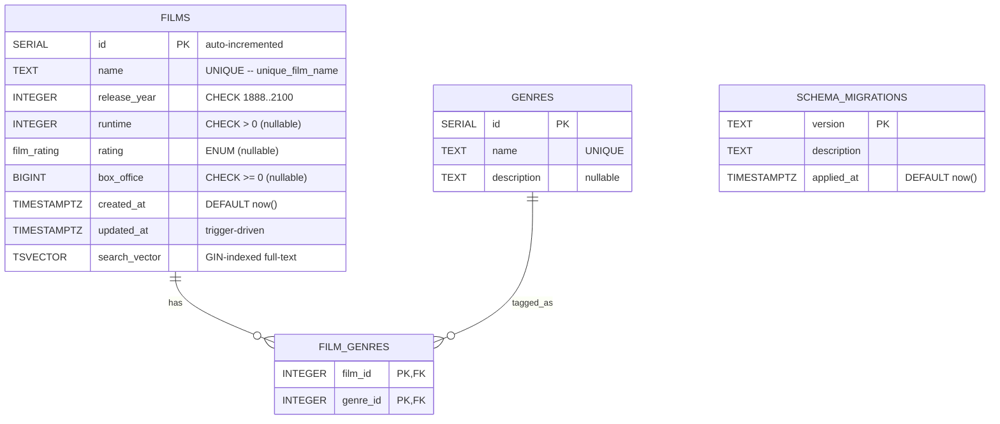

# Movie Database — PostgreSQL Blueprint

[](./.github/workflows/ci.yml)
[](https://www.postgresql.org/)
[](./docker-compose.yml)
[](./LICENSE)

A small, recruiter-friendly PostgreSQL project that demonstrates the
fundamentals every backend engineer is expected to ship: clean DDL,
idempotent and reversible migrations, transactional DML, retroactive
constraints, ENUM domain modeling, full-text search, audit triggers,
indexed reads, in-database assertions, CI, and a one-command local
environment via Docker Compose.

The database models a film catalog around four tables: `films`, `genres`,
the `film_genres` junction, and `schema_migrations`. Every artifact in this
repository is text-based and reproducible — no binary database files,
no committed credentials, no machine-specific paths.


---

## Table of Contents

1. [Highlights](#highlights)
2. [Tech Stack](#tech-stack)
3. [Repository Layout](#repository-layout)
4. [Entity-Relationship Diagram](#entity-relationship-diagram)
5. [Schema Reference](#schema-reference)
6. [Quick Start (Docker)](#quick-start-docker)
7. [Manual Setup (Local Postgres)](#manual-setup-local-postgres)
8. [Make Targets](#make-targets)
9. [Running the Migrations](#running-the-migrations)
10. [Sample Queries](#sample-queries)
11. [Testing the Schema](#testing-the-schema)
12. [Continuous Integration](#continuous-integration)
13. [Performance Notes](#performance-notes)
14. [What Is and Isn't Committed](#what-is-and-isnt-committed)
15. [License](#license)

---

## Highlights

- **Idempotent DDL.** `CREATE TABLE IF NOT EXISTS`, `DROP TABLE IF EXISTS`,
  `ADD COLUMN IF NOT EXISTS`, and `ON CONFLICT DO NOTHING` guards let every
  script be replayed safely.
- **Transactional DML.** Every mutating script is wrapped in `BEGIN … COMMIT`
  so partial failures roll back atomically.
- **Versioned, reversible migrations.** Each schema change ships with both an
  `up` and a sibling `_down.sql` file in [`migrations/`](migrations/).
- **Domain modeling.** `rating` is a `film_rating` ENUM, `category` was
  normalized into `genres` + `film_genres`, and CHECK constraints enforce
  basic invariants.
- **Audit trail.** `films.created_at` and `films.updated_at` (TIMESTAMPTZ)
  plus a `set_updated_at()` trigger so callers can never forget to touch it.
- **Full-text search.** A generated `tsvector` column with a GIN index
  powers `websearch_to_tsquery` lookups out of the box.
- **CI-verified.** A GitHub Actions workflow boots Postgres, applies the
  schema + seed, replays the migration chain, and runs in-database
  assertions on every push.
- **One-command bring-up.** `docker compose up -d` starts Postgres
  (auto-provisioned via the `*.sql` init hook) **and** an Adminer sidecar
  on `http://localhost:8080` for browser-based inspection.
- **Self-documenting.** `COMMENT ON TABLE` / `COMMENT ON COLUMN` calls
  surface metadata in `psql \d+` and every GUI client.

## Tech Stack

| Layer        | Choice                                                |
| ------------ | ----------------------------------------------------- |
| Database     | PostgreSQL 12+ (CI runs `postgres:16-alpine`)         |
| Local infra  | Docker Compose v2, Adminer (web GUI)                  |
| Tooling      | `psql`, `make`, [`sqlfluff`](https://sqlfluff.com/)   |
| CI           | GitHub Actions                                        |
| Language     | Pure SQL — no ORM, no application layer               |

## Repository Layout

```
.
├── .env.example                       # Template for required env vars (blank values)
├── .gitignore                         # Excludes secrets, data dirs, dumps, logs
├── .sqlfluff                          # Lint configuration
├── .github/
│   └── workflows/
│       └── ci.yml                     # Schema + seed + migrations + lint pipeline
├── docker-compose.yml                 # Postgres + Adminer one-command bring-up
├── Makefile                           # make up | psql | seed | migrate | test | lint
├── LICENSE                            # MIT
├── CHANGELOG.md                       # Versioned change history
├── PRD.md                             # Product Requirements Document
├── README.md                          # You are here
├── schema.sql                         # Consolidated DDL (final state)
├── seed.sql                           # Sample non-sensitive seed data
├── docs/
│   ├── er-diagram.svg                 # Lightweight vector ER diagram
│   └── PERFORMANCE.md                 # EXPLAIN ANALYZE walkthroughs
├── migrations/                        # Numbered up + down migrations
│   ├── 001_create_films_table.sql
│   ├── 001_create_films_table_down.sql
│   ├── 002_seed_initial_films.sql
│   ├── 002_seed_initial_films_down.sql
│   ├── 003_add_metadata_columns.sql
│   ├── 003_add_metadata_columns_down.sql
│   ├── 004_backfill_metadata.sql
│   ├── 004_backfill_metadata_down.sql
│   ├── 005_add_unique_film_name_constraint.sql
│   ├── 005_add_unique_film_name_constraint_down.sql
│   ├── 006_add_indexes.sql
│   ├── 006_add_indexes_down.sql
│   ├── 007_add_check_constraints.sql
│   ├── 007_add_check_constraints_down.sql
│   ├── 008_add_audit_timestamps.sql
│   ├── 008_add_audit_timestamps_down.sql
│   ├── 009_promote_rating_to_enum.sql
│   ├── 009_promote_rating_to_enum_down.sql
│   ├── 010_normalize_genres.sql
│   ├── 010_normalize_genres_down.sql
│   ├── 011_add_fulltext_search.sql
│   ├── 011_add_fulltext_search_down.sql
│   ├── 012_add_schema_migrations_table.sql
│   └── 012_add_schema_migrations_table_down.sql
├── queries/                           # Example reads
│   ├── filter_by_release_year.sql
│   ├── aggregate_box_office_by_category.sql
│   ├── fulltext_search_titles.sql
│   └── test_unique_constraint.sql
└── tests/
    └── test_schema_assertions.sql     # In-database assertions used by CI
```

## Entity-Relationship Diagram

The full SVG lives at [`docs/er-diagram.svg`](docs/er-diagram.svg) and is
shown at the top of this README. The same schema rendered as a GitHub-native
Mermaid diagram:



## Schema Reference

### `films`

| Column          | Type           | Constraints                       |
| --------------- | -------------- | --------------------------------- |
| `id`            | `SERIAL`       | `PRIMARY KEY`                     |
| `name`          | `TEXT`         | `UNIQUE`, `NOT NULL`              |
| `release_year`  | `INTEGER`      | `NOT NULL`, `CHECK 1888..2100`    |
| `runtime`       | `INTEGER`      | `CHECK > 0` (nullable)            |
| `rating`        | `film_rating`  | ENUM domain (nullable)            |
| `box_office`    | `BIGINT`       | `CHECK >= 0` (nullable)           |
| `created_at`    | `TIMESTAMPTZ`  | `DEFAULT NOW()`                   |
| `updated_at`    | `TIMESTAMPTZ`  | `DEFAULT NOW()`, trigger-managed  |
| `search_vector` | `TSVECTOR`     | GENERATED, GIN-indexed            |

`film_rating` ENUM values: `G`, `PG`, `PG-13`, `R`, `NC-17`, `NR`.

### Other tables

- **`genres`** — `id SERIAL PK`, `name TEXT UNIQUE`, `description TEXT`.
- **`film_genres`** — `(film_id, genre_id)` composite PK; both columns are
  `ON DELETE CASCADE` FKs.
- **`schema_migrations`** — `version TEXT PK`, `description TEXT`,
  `applied_at TIMESTAMPTZ`. Records the migrations applied to this database.

### Indexes

| Index                          | Type      | Covers                                  |
| ------------------------------ | --------- | --------------------------------------- |
| `films_pkey`                   | B-tree    | `films.id` (implicit)                   |
| `unique_film_name`             | B-tree    | `films.name` (implicit)                 |
| `idx_films_release_year`       | B-tree    | `films.release_year`                    |
| `idx_films_rating`             | B-tree    | `films.rating`                          |
| `idx_films_search_vector`      | GIN       | `films.search_vector` (full-text)       |
| `idx_film_genres_genre_id`     | B-tree    | reverse lookup on `film_genres`         |

> `BIGINT` on `box_office` is intentional: top-grossing films exceed the
> ~2.147B ceiling of a 32-bit `INTEGER`.

---

## Quick Start (Docker)

```bash
# 1. Clone
git clone <your-fork-url> postgres-movie-db
cd postgres-movie-db

# 2. Create your local env file (values are NOT committed)
cp .env.example .env
#    Edit .env and fill in POSTGRES_USER, POSTGRES_PASSWORD, POSTGRES_DB, etc.

# 3. Start the stack
docker compose up -d

# 4. Open Adminer in your browser
open http://localhost:8080
#    System=PostgreSQL, Server=db, plus your .env credentials.

# 5. Or connect with psql from the host
psql -h localhost -p 5432 -U "$POSTGRES_USER" -d "$POSTGRES_DB"

# 6. Tear down (preserves data) / wipe (drops the volume too)
docker compose down
docker compose down -v
```

On first startup, Postgres executes `schema.sql` then `seed.sql`
automatically from `/docker-entrypoint-initdb.d/`, so the catalog is ready
before the container reports healthy.

## Manual Setup (Local Postgres)

```bash
createdb films_db
psql -U <user> -d films_db -f schema.sql
psql -U <user> -d films_db -f seed.sql
psql -U <user> -d films_db -f tests/test_schema_assertions.sql
```

## Make Targets

```text
make help        # show all available targets
make up          # start postgres + adminer
make wait        # block until postgres accepts connections
make psql        # interactive psql shell inside the container
make schema      # apply schema.sql
make seed        # load seed.sql
make migrate     # apply every up-migration in order
make reset       # nuke volume, re-create container, schema + seed
make test        # run the in-database assertion suite
make lint        # sqlfluff every .sql file
make down        # stop the stack (preserves the data volume)
make clean       # tear down volumes + delete local junk files
```

## Running the Migrations

```bash
make migrate
# or, manually:
for f in migrations/[0-9]*.sql; do
  [[ "$f" == *_down.sql ]] && continue
  echo "==> $f"
  psql -U <user> -d films_db -v ON_ERROR_STOP=1 -f "$f"
done
```

Replaying migrations 001–012 reaches the same final state as running
`schema.sql` + `seed.sql`. Every migration ships with a matching `_down.sql`
file for rollback.

This project does **not** ship a real migration runner; the
`schema_migrations` table mirrors the conventions of
[Flyway](https://flywaydb.org/), [sqitch](https://sqitch.org/),
[atlas](https://atlasgo.io/), and
[golang-migrate](https://github.com/golang-migrate/migrate) so it can be
wired up to one with minimal effort.

## Sample Queries

```bash
psql -U <user> -d films_db -f queries/filter_by_release_year.sql
psql -U <user> -d films_db -f queries/aggregate_box_office_by_category.sql
psql -U <user> -d films_db -f queries/fulltext_search_titles.sql
```

## Testing the Schema

In-database assertions live in
[`tests/test_schema_assertions.sql`](tests/test_schema_assertions.sql) and
verify, among other things:

- Every expected table exists.
- The `film_rating` ENUM has the six canonical values.
- Seed counts match expectations.
- `unique_film_name` rejects duplicate inserts with SQLSTATE `23505`.
- All three CHECK constraints fire with SQLSTATE `23514`.
- The `updated_at` trigger refreshes on UPDATE.
- Full-text search returns the expected hit.
- `schema_migrations` records every applied migration.

Run them locally:

```bash
make test
```

[`queries/test_unique_constraint.sql`](queries/test_unique_constraint.sql)
holds a hand-runnable transaction that intentionally violates the UNIQUE
constraint, useful for demonstrating the failure mode interactively.

## Continuous Integration

[`.github/workflows/ci.yml`](.github/workflows/ci.yml) runs on every push
and pull request to `main`:

1. **`schema-and-seed`** — boots a clean Postgres service container, applies
   `schema.sql`, loads `seed.sql`, and runs the in-database assertions.
2. **`migrations-chain`** — independently replays every numbered up-migration
   against a second fresh database to verify the chain reaches the final
   state without errors.
3. **`lint`** — runs `sqlfluff` against every `.sql` file in the repo.

## Performance Notes

[`docs/PERFORMANCE.md`](docs/PERFORMANCE.md) walks through how to read
`EXPLAIN (ANALYZE, BUFFERS)` output and shows the plan each index produces
for the common query shapes (equality, ENUM filter, full-text search,
junction join, UNIQUE lookup). It also includes catalog queries for
listing indexes, measuring their size, and identifying unused ones.

---

## What Is and Isn't Committed

| Tracked in git                                  | Excluded by `.gitignore`                          |
| ----------------------------------------------- | ------------------------------------------------- |
| `schema.sql`, `seed.sql`, `tests/`              | Real `.env` files with live credentials           |
| Every file under `migrations/` (up + down)      | Raw Postgres data dirs (`data/`, `pg_data/`)      |
| Every file under `queries/`                     | `*.dump`, `*.backup`, `*.sql.gz`, `backups/`      |
| `docker-compose.yml`, `Makefile`, `.sqlfluff`   | `*.log`, `logs/`, `pg_log/`                       |
| `.env.example` (blank template)                 | Editor and OS noise (`.idea/`, `.DS_Store`, …)    |
| `docs/er-diagram.svg`, `docs/PERFORMANCE.md`    | Container volume mounts (`.docker/`, `volumes/`)  |
| `.github/workflows/ci.yml`                      |                                                   |

If you need to share a database dump for debugging, generate it with
`pg_dump` and ship it out of band — **never** commit it to the repo.

## License

This project is licensed under the MIT License — see the
[`LICENSE`](LICENSE) file for details.
